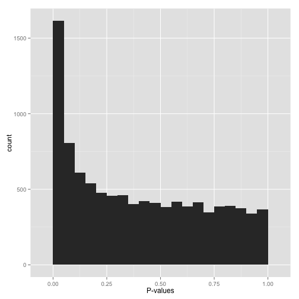
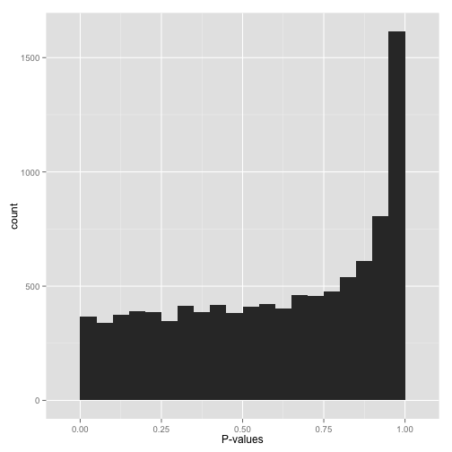
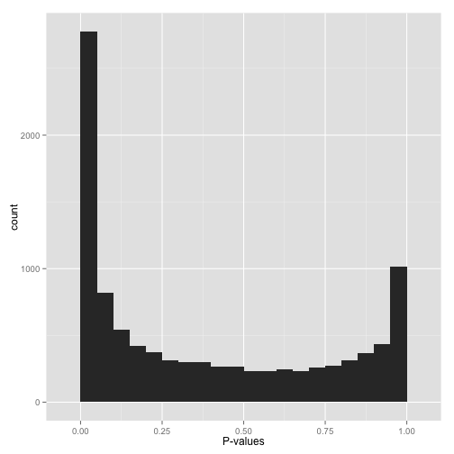

:::::::::::::::::::::::::::::::::::::: questions 

- How does correcting for the family-wise error rate (FWER) affect the number of significant hits in large-scale data, such as RNA-Seq analysis of 20,000 human genes?
- What is the interpretation of a p-value histogram, and how can it be used to assess the distribution of p-values in multiple testing scenarios?
- How can the Benjamini-Hochberg method be applied to control the false discovery rate (FDR) in RNA-Seq data, and what are the benefits of using this method over FWER correction?

::::::::::::::::::::::::::

:::::::::::::::::::::::::::::::::::::::::::::: objectives

- Demonstrate how correcting for the family-wise error rate (FWER) using methods like Bonferroni correction can lead to few or no significant hits in large-scale testing scenarios.
- Introduce the concept of p-value histograms, explain their interpretation, and illustrate how they can be used to visualize the distribution of p-values in multiple testing.
- Explain the Benjamini-Hochberg method for controlling the false discovery rate (FDR).
- Provide practical examples and R code to apply the Benjamini-Hochberg method to RNA-Seq data.
- Discuss the advantages of controlling the FDR over FWER in the context of large-scale genomic data. 

::::::::::::::::::::::::::::::::::::::::::::::::

# Introduction

In high-throughput experiments like RNA-Seq, we often conduct thousands of statistical tests simultaneously. This large number of tests increases the risk of false positives. While controlling the family-wise error rate (FWER), the probability of making at least one type I error, is one approach to address false positives, it can be too conservative, leading to few or no significant results. An alternative approach is to control the __False Discovery Rate (FDR)__, the expected proportion of false positives among the rejected hypotheses, which offers a balance between identifying true positives and limiting false positives. 

## Example: The Airway dataset in R

The Airway dataset contains gene expression data from a study investigating the effects of dexamethasone (a corticosteroid medication) on airway smooth muscle cells. The dataset is part of the airway package in Bioconductor, a project that provides tools for the analysis and comprehension of high-throughput genomic data.

In differentially expressed genes (DEGs) analysis, thousands of statistical tests (one for each gene) are conducted, which increases the chance of false positives. Using the airway dataset, we can decide to analyze DEGs between treated and untreated samples. Here, the null hypothesis would state that there is no difference in gene expression between the two groups ( dexamethasone treated and untreated). The __Table 1__ below shows the first six rows of the generated p-values for each gene, the data which, we are going use to see how using FWER and FDR to controlling for false positive differ. 


Table: Table 1: P_Values for each analysed gene

|gene            |    pvalue|
|:---------------|---------:|
|ENSG00000000003 | 0.0286636|
|ENSG00000000419 | 0.0428183|
|ENSG00000000457 | 0.7874802|
|ENSG00000000460 | 0.6972820|
|ENSG00000000938 | 0.6215698|
|ENSG00000000971 | 0.0885597|

## The Concept of P-value Histograms

A p-value histogram is a graphical representation that displays the distribution of p-values obtained from multiple hypothesis tests. When conducting a large number of statistical tests, such as in genome-wide association studies or RNA-Seq analysis, p-value histograms provide a visual tool to assess the behavior and distribution of p-values across all tests.

To create a p-value histogram, we plot the p-values on the x-axis and the frequency (or count) of those p-values on the y-axis. This visualization helps in understanding how the p-values are distributed across the range from 0 to 1.

Here, we will use our generated p-values for each analysed gene to create a histogram. 


We will also find out how many genes were significantly differentially expressed between the treated and untreated cells at α=0.05 before we correct for type 1 error.


```{.output}
4655 is the number of significant differentially expressed genes before FWER correction
```

:::::::::::::: challenge

- Now suppose we reject all tests with a p-value less than α=0.05. How can we visually determine an estimate of the false discovery proportion with a plot in r?

:::::::::::::::::::

::::::::::::::: solution


```r
alpha = 0.05
binw =0.01
pi0 = 2 * mean(gene_pvalues$pvalue > 0.5)
ggplot(gene_pvalues,
  aes(x = pvalue)) + geom_histogram(binwidth = binw, boundary = 0) +
  geom_hline(yintercept = pi0 * binw * nrow(gene_pvalues), col = "blue") +
  geom_vline(xintercept = alpha, col = "red")
```


:::::::::::::::::::::

Notice that there are many null hypotheses that appear at low p-values. Therefore, indiscriminately declaring all p-values less than 0.05 as significant will lead to a high number of false discoveries. Additionally, some true alternative hypotheses may have high p-values, leading to missed detections (false negatives) that our test cannot identify. 

### Interpretation of P-value Histograms

A p-value histogram helps identify patterns that might indicate issues or meaningful findings in our data. If all the null hypotheses are true (i.e., there is no effect), p-values should follow a uniform distribution. This means the histogram should show a relatively flat distribution of p-values across the range from 0 to 1. 


However, seeing this does not mean they actually are all null. It means that at most a small percentage of hypotheses are non-null and could be identified by a correction method. That is why applying an uncorrected rule like “Accept everything with p-value less than 0.05” is certain to give you many false discoveries. 

If there are true effects present, you would expect to see an excess of low p-values (close to 0) compared to what would be expected under a uniform distribution. This indicates potential significant findings. A large spike near zero can indicate that many tests are finding significant results, suggesting the presence of true positives. 




A right-skewed distribution, with most p-values clustering towards 1, might suggest that most tests are not finding significant results, indicating that there may be few true effects in the data.



P-values are designed to be uniform under the null hypothesis. Therefore, if we observe deviations from this expectation, it should not lead us to conclude that there are no significant hypotheses. Instead, it suggests that there may be issues with our testing methodology. For example, our test assumptions might not align with the actual data distribution. It is possible that the test assumes a certain data distribution (like continuous or normal), which doesn't match the actual characteristics of our data—such as it being discrete or highly non-normal.

Some histogram likeshown in  __Figure 11__ might exhibit pronounced spikes at p-values near zero and near one. 



This behavior often signals potential issues such as p-hacking or deficiencies in experimental design. For instance, in the context of a one-tailed test (e.g., assessing whether each gene increases expression in response to a drug), p-values nearing 1 may indicate significance in the opposite direction—instances where genes decreased their expression. If you wish to identify such cases, consider switching to a two-sided test. Alternatively, if these cases are irrelevant, filtering out instances where estimates point in that direction could be effective.

Moreover, in RNA-Seq data, for example, certain genes may show no reads across all conditions, leading some differential expression tools to return a p-value of 1. Identifying and filtering out such problematic cases beforehand can help streamline our analysis without sacrificing information."

Understanding the distribution of p-values can inform the choice of multiple testing correction methods. For example, if there is an excess of low p-values, controlling the false discovery rate (FDR) might be more appropriate than controlling the family-wise error rate (FWER). After applying a multiple testing correction (such as the Benjamini-Hochberg method), a p-value histogram of the adjusted p-values can help evaluate the effectiveness of the correction in controlling false positives.

# The impact of correcting for the family-wise error rate (FWER) using Bonferroni correction

Now, if we proceed to apply the Bonferroni method to correct the family-wise error rate (FWER), we can then determine the number of genes that show significant differential expression after the correction. 


```{.output}
706 is the number of significant differentially expressed genes after Bonferroni correction for FWER
```

## Interpretation

Applying the Bonferroni correction in this example results in __706__ differentially expressed genes due to the stringent threshold, demonstrating how FWER correction can be too conservative in large-scale testing.

# Controlling FDR Using the Benjamini-Hochberg Method

The Benjamini-Hochberg (BH) method is a statistical procedure used to control the FDR in multiple hypothesis testing, where the chance of obtaining false positives increases. The BH method helps control the proportion of false positives (false discoveries) among the rejected hypotheses, thus providing a more balanced approach than traditional methods like the __Bonferroni correction__, which can be overly conservative. The BH procedure adjusts the p-values from multiple tests to control the FDR. These adjusted p-values can be compared to a significance threshold to determine which results are significant.

## Steps of the Benjamini-Hochberg Procedure
First the observed p-values are arranged in ascending order. Next, ranks are assigned to the p-values, with the smallest p-value getting rank 1, the next smallest rank 2, and so on. Then, for each p-value, the BH critical value is calculated as;

$$\text{BH critical value} = \frac{i}{m} \times Q$$

where, i is the rank, m is the total number of tests, and 
Q is the desired FDR level (e.g., 0.05).

After this calculation, the largest p-value that is less than or equal to its BH critical value is identified. This p-value and all smaller p-values are considered significant. Optionally, one can adjust the p-values to reflect the BH correction using software functions.

Now, let us continue with the generated p_values to apply the Benjamini-Hochberg correction in r, and also plot the adjusted p values for comparison. 


```{.output}
2357 is the number of significant differentially expressed genes that pass the FDR threshold
```

## Interpretation

The Benjamini-Hochberg method controls the FDR, allowing for a greater number of significant differentially expressed genes (__2357__) compared to the Bonferroni correction (__706__). This approach provides a more balanced and powerful method for identifying true positives in large-scale data.

# Advantages of controlling the FDR over FWER in the context of large-scale genomic data

- Higher statistical power: FDR control allows for higher power compared to FWER control. In large-scale genomic studies, this means detecting more true positives while still controlling false discoveries. Since FDR methods are less stringent than FWER methods like Bonferroni correction, they balance between controlling false discoveries and maximizing true positives, reducing false negatives.

- Consistency across studies: By setting a fixed FDR threshold (e.g., 5%), results are more comparable across different studies and meta-analyses, enhancing consistency in statistical inference.

It is important to note that while FDR is preferred in many genomic screens due to its ability to handle a large number of hypotheses, FWER control remains appropriate in scenarios where minimizing any false positives is critical. Each method has its place depending on the research context and goals.

NB//: The aim of any multiple hypothesis test correction methods, such as controlling the Family-Wise Error Rate (FWER) or the False Discovery Rate (FDR), is to determine an appropriate threshold or cutoff for declaring statistical significance across multiple tests or hypotheses.


### Further reading 

- [How to interpret a p-value histogram]("http://varianceexplained.org/statistics/interpreting-pvalue-histogram/")


:::::::::::::::::::::::::::::::::::::::::::::::::::::::::::::::::::: instructor

Inline instructor notes can help inform instructors of timing challenges
associated with the lessons. They appear in the "Instructor View"

::::::::::::::::::::::::::::::::::::::::::::::::::::::::::::::::::::::::::::::::
